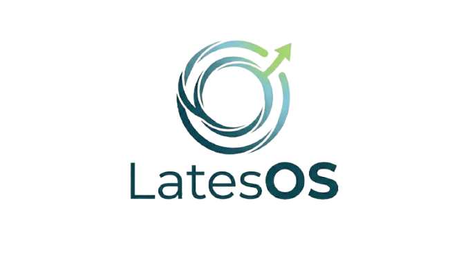
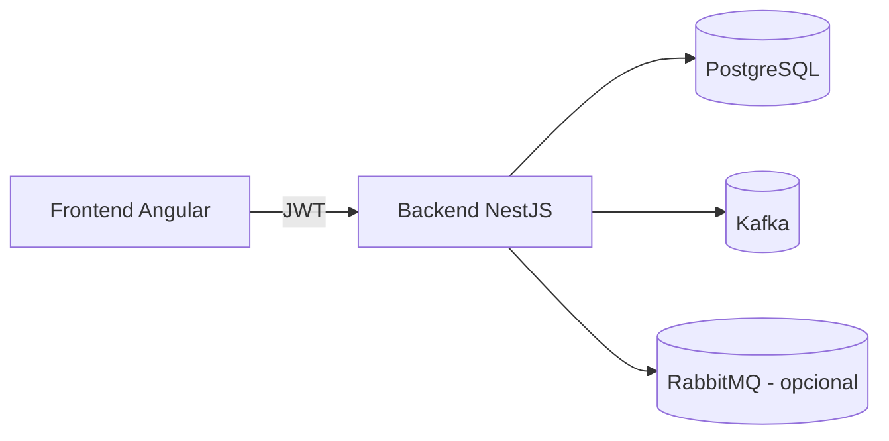
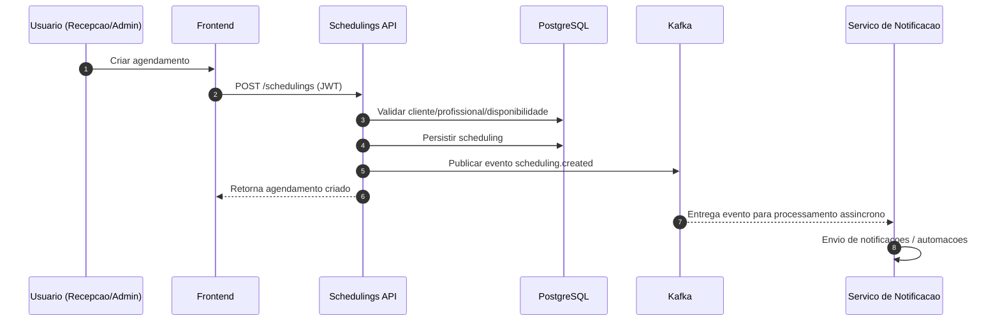
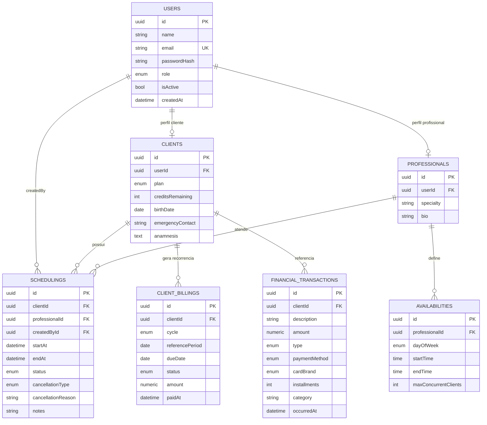

# LatesOS

<p align="center">
  
</p>

<p align="center">
  Plataforma de gestao operacional para clinicas de Pilates e Fisioterapia.
</p>

<p align="center">
  
  
  
  
  
  
  
</p>

## Sumario

- [Visao Executiva](#visao-executiva)
- [Problema de Negocio](#problema-de-negocio)
- [Solucoes Entregues pelo LatesOS](#solucoes-entregues-pelo-latesos)
- [Arquitetura da Plataforma](#arquitetura-da-plataforma)
- [Fluxo de Agendamentos com Kafka e Banco](#fluxo-de-agendamentos-com-kafka-e-banco)
- [Modelo de Dados Principal](#modelo-de-dados-principal)
- [Modulos do Sistema](#modulos-do-sistema)
- [Tecnologias](#tecnologias)
- [Como Executar Localmente](#como-executar-localmente)
- [Ambientes e Configuracoes](#ambientes-e-configuracoes)
- [Qualidade e Observabilidade](#qualidade-e-observabilidade)
- [Seguranca](#seguranca)
- [Roadmap Tecnico](#roadmap-tecnico)
- [Documentacao Complementar](#documentacao-complementar)

## Visao Executiva

O **LatesOS** e uma plataforma de gestao completa para operacao clinica, integrando atendimento, agenda, financeiro e analise gerencial em uma unica solucao.

A proposta e reduzir retrabalho operacional e aumentar previsibilidade de receita, organizando o ciclo completo da clinica:

- captacao e cadastro,
- agendamento e execucao,
- cobranca e recorrencia,
- analise de eficiencia e auditoria.

## Problema de Negocio

Clinicas de Pilates e Fisioterapia frequentemente enfrentam os seguintes gargalos:

- Dados espalhados em ferramentas diferentes (agenda, planilha, WhatsApp, anotacoes locais).
- Falta de rastreabilidade sobre cancelamentos, no-show e remarcacoes.
- Dificuldade em controlar mensalidades, planos e recebimentos recorrentes.
- Ausencia de indicadores confiaveis para tomada de decisao da gestao.
- Dependencia de processos manuais para orcamentos e comunicacao entre equipes.

Impactos diretos:

- perda de receita,
- baixa produtividade de recepcao,
- experiencia inconsistente para cliente,
- visibilidade limitada para crescimento sustentavel.

## Solucoes Entregues pelo LatesOS

O sistema resolve esses pontos com uma arquitetura orientada a dominio clinico:

- **Fonte unica de verdade** para clientes, profissionais, agenda e financeiro.
- **Agenda inteligente** com validacoes de conflito, remarcacao e cancelamento tipado.
- **Financeiro recorrente** com status de mensalidade/plano e baixa automatica de pagamento.
- **Relatorios gerenciais** de eficiencia por profissional e auditoria de abertura de agendamento.
- **Orcamento em PDF** padronizado para acelerar fechamento comercial.
- **Eventos assincronos** via Kafka para evolucao de notificacoes e integracoes.

## Arquitetura da Plataforma



## Fluxo de Agendamentos com Kafka e Banco



## Modelo de Dados Principal



## Modulos do Sistema

- **Auth**
  - Login, refresh token e logout.
  - Controle por perfis (`ADMIN`, `RECEPTIONIST`, `PROFESSIONAL`, `CLIENT`).
- **Clientes**
  - CRUD completo, plano, creditos e anamnese.
  - Busca e manutencao de dados clinicos.
- **Profissionais**
  - CRUD, especialidades e disponibilidade semanal.
  - Base para calculo de slots disponiveis.
- **Agenda**
  - Criacao, check-in manual de presenca, remarcacao, conclusao e cancelamento com motivo.
  - Regras para evitar conflito e horario invalido.
- **Financeiro**
  - Entradas/saidas e dashboard de fluxo.
  - Assinaturas recorrentes (mensal, trimestral, anual).
- **Relatorios**
  - Eficiencia por profissional.
  - Auditoria de abertura e resultado dos agendamentos.
- **Servicos e Orcamento**
  - Catalogo de servicos.
  - Geracao de orcamento em PDF.

## Tecnologias

### Backend

- NestJS 11
- TypeORM
- PostgreSQL
- JWT
- Kafka
- RabbitMQ (habilitavel)
- Swagger/OpenAPI

### Frontend

- Angular 21 (standalone)
- TypeScript
- SCSS
- RxJS

## Como Executar Localmente

### 1) Infraestrutura

Opcional com Docker:

```bash
docker compose up -d postgres rabbitmq kafka
```

### 2) Backend

```bash
cd backend
npm install
npm run migration:run
npm run start:dev
```

API: `http://localhost:3000`  
Swagger: `http://localhost:3000/api`

### 3) Frontend

```bash
cd frontend
npm install
npm run start
```

Aplicacao: `http://localhost:4200`

## Ambientes e Configuracoes

Variaveis sensiveis ficam no `.env` do backend.

Credenciais seed padrao (conforme ambiente local):

- Email: `admin@pilatesos.com`
- Senha: `admin123`

Marca visual:

- `frontend/public/assets/logo.png`

## Qualidade e Observabilidade

- Validacao de entrada com `class-validator`.
- Interceptor global para padronizacao de resposta.
- Estrutura preparada para evoluir monitoramento (logs, metricas e alertas).
- Testes unitarios presentes em modulos criticos (ex.: seeds e agenda).

## Testes Automatizados

- Backend: `cd backend && npm run test:ci`
- Frontend: `cd frontend && npm run test:ci`
- Mobile: `cd mobile-app && npm run test:ci`
- Suite completa (todos os projetos): `powershell -ExecutionPolicy Bypass -File .\scripts\run-all-tests.ps1`

## Seguranca

- Autenticacao JWT com refresh token.
- Guardas por role para controle de autorizacao.
- CORS configuravel por ambiente.
- Recomendado para producao:
  - rotacao de segredos,
  - HTTPS,
  - rate limit,
  - politicas de backup e restore.

## Roadmap Tecnico

- Cobertura E2E dos fluxos criticos.
- Integração de gateway de pagamento.
- Observabilidade completa (tracing, dashboards e alertas).
- Politicas de governanca de dados (LGPD, auditoria ampliada).

## Documentacao Complementar

- [Backend README](./backend/README.md)
- [Frontend README](./frontend/README.md)
